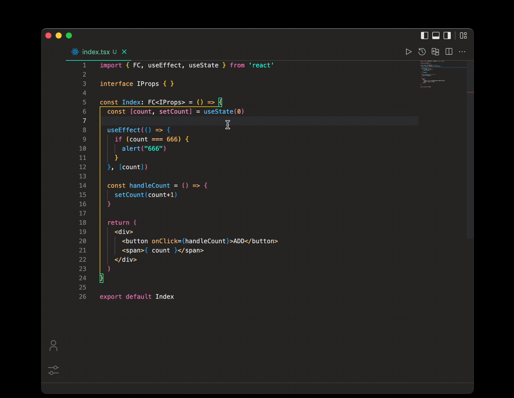

<sub><em>Layered Comments for VS Code</em></sub>
<h1 align="center">
  
</h1>

## 简介

自定义代码片段分层注释，让代码结构更加简洁


## 效果
<h2 align="center">
  
</h2>

## 功能

1. 单行英文注释
2. 多行英文注释
3. 多语言注释
4. 自定义配置宽度及填充符号

## 快捷键

**Mac：**<kbd>Cmd</kbd> + <kbd>Ctrl</kbd> + <kbd>/</kbd>

**Win：**<kbd>Ctrl</kbd> + <kbd>Alt</kbd> + <kbd>/</kbd>

## 配置

```json
{
  "layeredComments.style": {
    // 填充宽度
    "width": 40,
    // 填充符号
    "fillSym": "*"
  }
}
```

## 示例

<h2 align="center">
  
</h2>