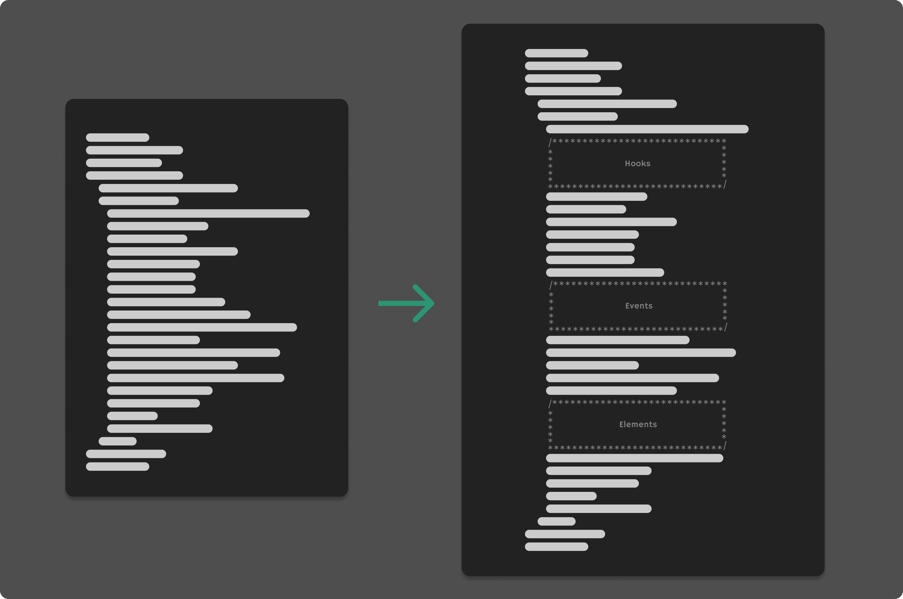

<em>Layered Comments for VS Code</em>
<h1 align="center">
  
</h1>

## 简介

自定义代码片段分层注释，让代码结构更加简洁

## 功能

1. 单行英文注释
2. 多语言注释

## 待办

- [ ] 支持多行注释
- [x] 支持多语言注释
- [ ] 支持自定义配置
   - [ ] 自定义符号
   - [ ] 自定义宽度
   - [ ] ...
- [ ] 锚点定位???

## 快捷键

**Mac：**<kbd>Cmd</kbd> + <kbd>Ctrl</kbd> + <kbd>/</kbd>

**Win：**<kbd>Ctrl</kbd> + <kbd>Alt</kbd> + <kbd>/</kbd>

## 配置

todo

## 效果
<h2 align="center">
  
</h2>
